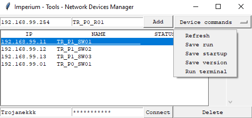

# Network device manager
Simple graphic manager, which helps in managing network devices (switches, routers, firewalls) from diffrent brands (Cisco, ~~HPE~~, ~~Fortigate~~, ~~Ubiquiti~~)

## Usage
    1. Clone github repo
    2. Install thir-party libraries
```ruby
pip install -r requirements.txt
```
    3. Run main.py
    4. Add new device
    5. Fill credentials and connect to the selected device
    6. Execute commands

## Preview
    